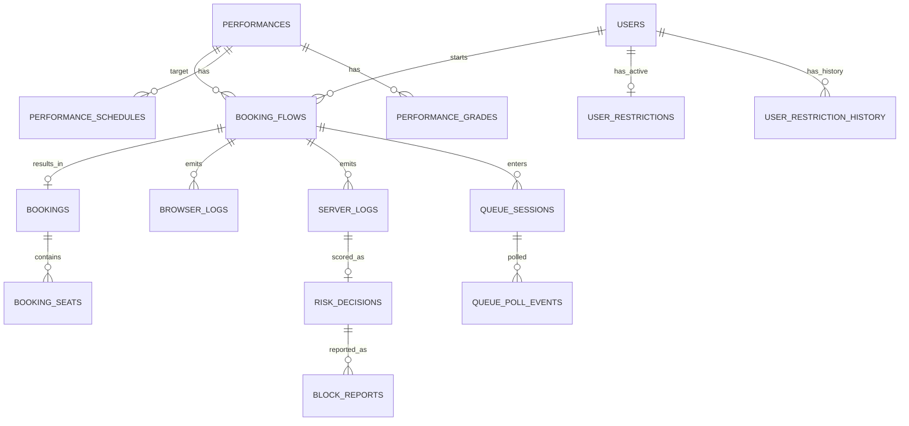

# 데이터베이스 설계 제안서 (현재 코드 기반)

## 1) 어떤 DB를 쓰는 것이 좋은가

현재 프로젝트는 예매 트랜잭션(사용자/공연/예매/제한 관리)과 로그 데이터(브라우저/서버/리스크)가 함께 존재한다.  
이 경우 **기본 선택은 PostgreSQL 16**이 가장 무난하다.

- 장점 1: 예매/사용자/관리자 기능에 필요한 관계형 트랜잭션을 안정적으로 처리할 수 있다.
- 장점 2: 로그처럼 필드가 자주 바뀌는 데이터는 `JSONB`로 유연하게 저장할 수 있다.
- 장점 3: 인덱스, 파티셔닝, 백업/복구, 운영 도구가 성숙해 실무 적용이 쉽다.

추가로 대기열 상태를 실시간으로 처리하려면 **Redis**를 보조로 두는 것이 좋다.  
현재 코드는 대기열 상태를 메모리(dict)에 두고 있어 단일 서버에서는 동작하지만, 서버가 여러 대로 늘어나면 상태 공유가 어려워진다. Redis를 사용하면 대기열 상태/토큰/TTL을 안정적으로 공유할 수 있다.

정리:
- 1순위(필수): PostgreSQL
- 2순위(권장): Redis(대기열 실시간 상태)

---

## 2) 필요한 테이블과 저장 용도

### 2-1. 운영(예매/관리) 테이블

| 테이블명 | 저장 용도 | 핵심 필드 예시 |
|---|---|---|
| `users` | 회원 기본 정보 저장 | `user_id`, `email`, `password_hash`, `name`, `phone`, `created_at` |
| `performances` | 공연 마스터 정보 | `performance_id`, `title`, `category`, `venue`, `open_time`, `status` |
| `performance_schedules` | 공연 날짜/회차 분리 저장 | `schedule_id`, `performance_id`, `show_date`, `show_time` |
| `performance_grades` | 좌석 등급/가격 정보 | `grade_id`, `performance_id`, `grade_name`, `price`, `seat_quota` |
| `booking_flows` | 브라우저 플로우 단위 추적(flow/session) | `flow_id`, `session_id`, `user_id`, `performance_id`, `started_at`, `completed_at`, `completion_status` |
| `bookings` | 실제 예매 결과(마이페이지/취소/배송의 기준) | `booking_id`, `flow_id`, `user_id`, `performance_id`, `selected_date`, `selected_time`, `status`, `cancelled_at` |
| `booking_seats` | 예매 좌석 상세 | `booking_id`, `seat_no`, `grade_name`, `price` |
| `user_restrictions` | 현재 활성화된 제한 상태 | `user_id`, `level`, `reason`, `restricted_at`, `expires_at`, `restricted_by` |
| `user_restriction_history` | 제한/해제 이력 감사 로그 | `history_id`, `user_id`, `action`, `level`, `reason`, `actor`, `created_at` |

### 2-2. 로그/탐지 테이블

| 테이블명 | 저장 용도 | 핵심 필드 예시 |
|---|---|---|
| `browser_logs` | `/api/logs`로 들어오는 플로우 로그 원본 저장 | `browser_log_id`, `flow_id`, `session_id`, `user_id`, `performance_id`, `booking_id`, `total_duration_ms`, `raw_json` |
| `server_logs` | 미들웨어에서 생성되는 API 요청 단위 로그 | `server_log_id`, `request_id`, `event_id`, `flow_id`, `session_id`, `endpoint`, `method`, `status_code`, `latency_ms`, `raw_json` |
| `risk_decisions` | 요청별 리스크 점수/판정 결과 | `risk_id`, `request_id`, `decision`, `risk_score`, `rule_score`, `model_score`, `hard_action`, `triggered_rules` |
| `block_reports` | 차단/챌린지 리포트 메타 정보 | `report_id`, `request_id`, `flow_id`, `session_id`, `booking_id`, `decision`, `risk_score`, `report_path`, `llm_report_path` |
| `queue_sessions` | 대기열 상태(조인~입장) 저장 | `queue_id`, `performance_id`, `flow_id`, `session_id`, `state`, `join_at`, `ready_at`, `entered_at`, `jump_count` |
| `queue_poll_events` | 대기열 폴링 이벤트(선택) | `event_id`, `queue_id`, `polled_at`, `interval_ms`, `position`, `total_queue` |

---

## 3) ER 다이어그램 (Mermaid)



---

## 4) PostgreSQL 스키마 예시 (DDL)

아래 스키마는 "현재 파일 기반 구조를 DB로 이전"하기 위한 실무형 초안이다.

```sql
-- =========================
-- 0. 공통 타입
-- =========================
CREATE TYPE decision_type AS ENUM ('allow', 'challenge', 'block');
CREATE TYPE booking_status_type AS ENUM ('completed', 'cancelled', 'failed', 'abandoned');
CREATE TYPE queue_state_type AS ENUM ('waiting', 'ready', 'entered', 'expired', 'left');

-- =========================
-- 1. 운영 테이블
-- =========================
CREATE TABLE users (
    user_id              BIGSERIAL PRIMARY KEY,
    email                TEXT NOT NULL UNIQUE,
    password_hash        TEXT NOT NULL,
    name                 TEXT NOT NULL,
    phone                TEXT,
    role                 TEXT NOT NULL DEFAULT 'user',
    created_at           TIMESTAMPTZ NOT NULL DEFAULT now(),
    updated_at           TIMESTAMPTZ NOT NULL DEFAULT now()
);

CREATE TABLE performances (
    performance_id       TEXT PRIMARY KEY,
    title                TEXT NOT NULL,
    category             TEXT NOT NULL,
    venue                TEXT NOT NULL,
    image_url            TEXT,
    description          TEXT,
    open_time            TIMESTAMPTZ,
    status               TEXT NOT NULL DEFAULT 'upcoming',
    created_at           TIMESTAMPTZ NOT NULL DEFAULT now(),
    updated_at           TIMESTAMPTZ NOT NULL DEFAULT now()
);

CREATE TABLE performance_schedules (
    schedule_id          BIGSERIAL PRIMARY KEY,
    performance_id       TEXT NOT NULL REFERENCES performances(performance_id) ON DELETE CASCADE,
    show_date            DATE NOT NULL,
    show_time            TIME NOT NULL,
    UNIQUE (performance_id, show_date, show_time)
);

CREATE TABLE performance_grades (
    grade_id             BIGSERIAL PRIMARY KEY,
    performance_id       TEXT NOT NULL REFERENCES performances(performance_id) ON DELETE CASCADE,
    grade_name           TEXT NOT NULL,
    price                INTEGER NOT NULL CHECK (price >= 0),
    seat_quota           INTEGER,
    UNIQUE (performance_id, grade_name)
);

CREATE TABLE booking_flows (
    flow_id              TEXT PRIMARY KEY,
    session_id           TEXT NOT NULL,
    user_id              BIGINT REFERENCES users(user_id),
    performance_id       TEXT REFERENCES performances(performance_id),
    bot_type             TEXT,
    started_at           TIMESTAMPTZ,
    completed_at         TIMESTAMPTZ,
    completion_status    TEXT,
    total_duration_ms    INTEGER,
    created_at           TIMESTAMPTZ NOT NULL DEFAULT now()
);

CREATE INDEX idx_booking_flows_session_id ON booking_flows(session_id);
CREATE INDEX idx_booking_flows_user_id ON booking_flows(user_id);
CREATE INDEX idx_booking_flows_performance_id ON booking_flows(performance_id);

CREATE TABLE bookings (
    booking_id           TEXT PRIMARY KEY,
    flow_id              TEXT UNIQUE REFERENCES booking_flows(flow_id) ON DELETE SET NULL,
    user_id              BIGINT REFERENCES users(user_id),
    performance_id       TEXT REFERENCES performances(performance_id),
    selected_date        DATE,
    selected_time        TIME,
    payment_type         TEXT,
    selected_discount    TEXT,
    delivery_type        TEXT,
    delivery_address     TEXT,
    delivery_status      TEXT DEFAULT '준비중',
    status               booking_status_type NOT NULL DEFAULT 'completed',
    cancelled_reason     TEXT,
    cancelled_by         TEXT,
    cancelled_at         TIMESTAMPTZ,
    created_at           TIMESTAMPTZ NOT NULL DEFAULT now(),
    updated_at           TIMESTAMPTZ NOT NULL DEFAULT now()
);

CREATE INDEX idx_bookings_user_id ON bookings(user_id);
CREATE INDEX idx_bookings_performance_id ON bookings(performance_id);
CREATE INDEX idx_bookings_created_at ON bookings(created_at DESC);

CREATE TABLE booking_seats (
    booking_seat_id      BIGSERIAL PRIMARY KEY,
    booking_id           TEXT NOT NULL REFERENCES bookings(booking_id) ON DELETE CASCADE,
    seat_no              TEXT NOT NULL,
    grade_name           TEXT,
    price                INTEGER CHECK (price >= 0)
);

CREATE INDEX idx_booking_seats_booking_id ON booking_seats(booking_id);

CREATE TABLE user_restrictions (
    user_id              BIGINT PRIMARY KEY REFERENCES users(user_id) ON DELETE CASCADE,
    level                SMALLINT NOT NULL CHECK (level IN (1,2,3)),
    reason               TEXT NOT NULL,
    restricted_by        TEXT NOT NULL,
    restricted_at        TIMESTAMPTZ NOT NULL,
    expires_at           TIMESTAMPTZ
);

CREATE TABLE user_restriction_history (
    history_id           BIGSERIAL PRIMARY KEY,
    user_id              BIGINT REFERENCES users(user_id) ON DELETE CASCADE,
    action               TEXT NOT NULL CHECK (action IN ('restrict', 'unrestrict')),
    level                SMALLINT,
    reason               TEXT,
    actor                TEXT NOT NULL,
    created_at           TIMESTAMPTZ NOT NULL DEFAULT now()
);

CREATE INDEX idx_restriction_history_user_id ON user_restriction_history(user_id, created_at DESC);

-- =========================
-- 2. 로그/리스크 테이블
-- =========================
CREATE TABLE browser_logs (
    browser_log_id       BIGSERIAL PRIMARY KEY,
    flow_id              TEXT NOT NULL REFERENCES booking_flows(flow_id) ON DELETE CASCADE,
    session_id           TEXT,
    user_id              BIGINT REFERENCES users(user_id),
    performance_id       TEXT REFERENCES performances(performance_id),
    booking_id           TEXT,
    completion_status    TEXT,
    is_completed         BOOLEAN,
    total_duration_ms    INTEGER,
    created_at           TIMESTAMPTZ,
    raw_json             JSONB NOT NULL
);

CREATE INDEX idx_browser_logs_flow_id ON browser_logs(flow_id);
CREATE INDEX idx_browser_logs_created_at ON browser_logs(created_at DESC);
CREATE INDEX idx_browser_logs_raw_json_gin ON browser_logs USING GIN (raw_json);

CREATE TABLE server_logs (
    server_log_id                        BIGSERIAL PRIMARY KEY,
    event_id                             TEXT NOT NULL UNIQUE,
    request_id                           TEXT NOT NULL UNIQUE,
    occurred_at                          TIMESTAMPTZ NOT NULL,
    flow_id                              TEXT REFERENCES booking_flows(flow_id) ON DELETE SET NULL,
    session_id                           TEXT,
    performance_id                       TEXT REFERENCES performances(performance_id),
    user_id                              BIGINT REFERENCES users(user_id),
    endpoint                             TEXT NOT NULL,
    method                               TEXT NOT NULL,
    status_code                          INTEGER,
    latency_ms                           INTEGER,
    response_size_bytes                  INTEGER,
    ip_hash                              TEXT,
    ip_subnet                            TEXT,
    user_agent_hash                      TEXT,
    accept_language                      TEXT,
    queue_id                             TEXT,
    queue_position                       INTEGER,
    queue_jump_count                     INTEGER,
    requests_last_1s                     INTEGER,
    requests_last_10s                    INTEGER,
    requests_last_60s                    INTEGER,
    unique_endpoints_last_60s            INTEGER,
    login_attempts_last_10m              INTEGER,
    login_fail_count_last_10m            INTEGER,
    login_success_count_last_10m         INTEGER,
    login_unique_accounts_last_10m       INTEGER,
    security_blocked                     BOOLEAN,
    security_captcha_required            BOOLEAN,
    security_block_reason                TEXT,
    raw_json                             JSONB NOT NULL
);

CREATE INDEX idx_server_logs_occurred_at ON server_logs(occurred_at DESC);
CREATE INDEX idx_server_logs_flow_id ON server_logs(flow_id);
CREATE INDEX idx_server_logs_session_id ON server_logs(session_id);
CREATE INDEX idx_server_logs_endpoint_method ON server_logs(endpoint, method, occurred_at DESC);
CREATE INDEX idx_server_logs_raw_json_gin ON server_logs USING GIN (raw_json);

CREATE TABLE risk_decisions (
    risk_id                BIGSERIAL PRIMARY KEY,
    request_id             TEXT NOT NULL UNIQUE REFERENCES server_logs(request_id) ON DELETE CASCADE,
    flow_id                TEXT,
    session_id             TEXT,
    decision               decision_type NOT NULL,
    risk_score             NUMERIC(10,6) NOT NULL,
    rule_score             NUMERIC(10,6),
    model_score            NUMERIC(10,6),
    model_type             TEXT,
    hard_action            TEXT,
    review_required        BOOLEAN DEFAULT FALSE,
    block_recommended      BOOLEAN DEFAULT FALSE,
    threshold_allow        NUMERIC(10,6),
    threshold_challenge    NUMERIC(10,6),
    runtime_error          TEXT,
    triggered_rules        JSONB,
    created_at             TIMESTAMPTZ NOT NULL DEFAULT now()
);

CREATE INDEX idx_risk_decisions_decision ON risk_decisions(decision, created_at DESC);
CREATE INDEX idx_risk_decisions_flow_id ON risk_decisions(flow_id);

CREATE TABLE block_reports (
    report_row_id           BIGSERIAL PRIMARY KEY,
    report_id               TEXT UNIQUE,
    request_id              TEXT REFERENCES server_logs(request_id) ON DELETE SET NULL,
    flow_id                 TEXT,
    session_id              TEXT,
    booking_id              TEXT,
    user_id                 BIGINT REFERENCES users(user_id),
    decision                decision_type,
    risk_score              NUMERIC(10,6),
    report_path             TEXT,
    llm_report_path         TEXT,
    llm_report_json_path    TEXT,
    report_json             JSONB,
    created_at              TIMESTAMPTZ NOT NULL DEFAULT now()
);

CREATE INDEX idx_block_reports_created_at ON block_reports(created_at DESC);
CREATE INDEX idx_block_reports_decision ON block_reports(decision, created_at DESC);

CREATE TABLE queue_sessions (
    queue_id                 TEXT PRIMARY KEY,
    performance_id           TEXT REFERENCES performances(performance_id),
    flow_id                  TEXT REFERENCES booking_flows(flow_id) ON DELETE SET NULL,
    session_id               TEXT NOT NULL,
    user_id                  BIGINT REFERENCES users(user_id),
    state                    queue_state_type NOT NULL,
    enter_trigger            TEXT,
    join_at                  TIMESTAMPTZ NOT NULL,
    ready_at                 TIMESTAMPTZ,
    entered_at               TIMESTAMPTZ,
    expired_at               TIMESTAMPTZ,
    jump_count               INTEGER NOT NULL DEFAULT 0,
    poll_interval_stats      JSONB,
    queue_meta               JSONB
);

CREATE INDEX idx_queue_sessions_flow_id ON queue_sessions(flow_id);
CREATE INDEX idx_queue_sessions_performance_id ON queue_sessions(performance_id, join_at DESC);

CREATE TABLE queue_poll_events (
    poll_event_id            BIGSERIAL PRIMARY KEY,
    queue_id                 TEXT NOT NULL REFERENCES queue_sessions(queue_id) ON DELETE CASCADE,
    polled_at                TIMESTAMPTZ NOT NULL DEFAULT now(),
    interval_ms              INTEGER,
    position                 INTEGER,
    total_queue              INTEGER
);

CREATE INDEX idx_queue_poll_events_queue_id ON queue_poll_events(queue_id, polled_at DESC);
```

---

## 5) 마이그레이션 우선순위 (권장)

1. 1단계: `users`, `performances`, `booking_flows`, `bookings`, `booking_seats` 먼저 이전  
2. 2단계: `server_logs`, `browser_logs`, `risk_decisions`, `block_reports` 이전  
3. 3단계: 대기열 상태를 Redis(`queue:*`, `start_token:*`, `entry_ticket:*`)로 분리  

이 순서로 진행하면 현재 기능을 크게 흔들지 않고 파일 기반 저장을 점진적으로 DB 기반으로 전환할 수 있다.

