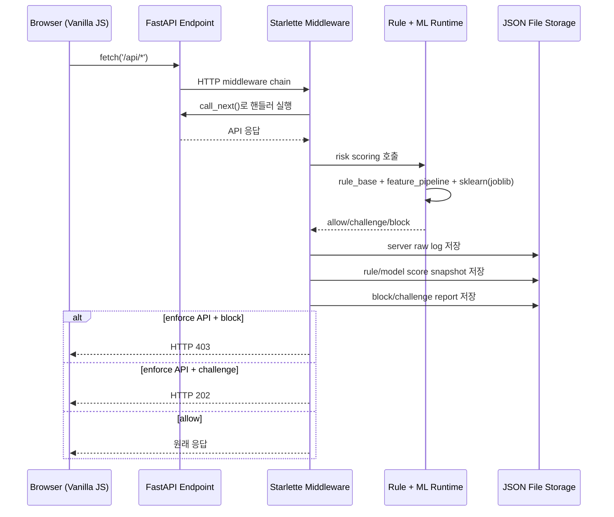
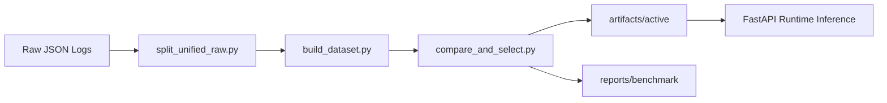

# 프로젝트 시스템 아키텍처 (기술 스택 중심)

## 1) 기술 스택 기반 아키텍처 맵
```mermaid
flowchart LR
    subgraph FE[Frontend Stack]
        HTML[HTML Pages\nindex/login/queue/seat/payment]
        CSS[CSS\ncss/*.css]
        JS[Vanilla JavaScript\njs/*.js]
        WEBAPI[Browser API\nFetch/sessionStorage/sendBeacon]
    end

    subgraph BOT[Automation Stack]
        NODE[Node.js]
        PUP[Puppeteer\nautomation/*.js]
    end

    subgraph BE[Backend Stack]
        UVI[Uvicorn ASGI Server]
        FAST[FastAPI + Starlette]
        MID[HTTP Middleware\nserver_log_middleware]
        PYD[Pydantic Models\n요청/응답 스키마]
    end

    subgraph RISK[Risk/ML Runtime Stack]
        RULE[Python Rule Engine\nmodel/src/rules/rule_base.py]
        FEAT[Feature Pipeline\nmodel/src/features/feature_pipeline.py]
        NUMPY[NumPy]
        SK[scikit-learn\nIsolationForest/OneClassSVM]
        JOBLIB[joblib\n모델 아티팩트 로드]
        SHAP[SHAP\n모델 기여도 설명]
        TORCH[PyTorch\nDeepSVDD (옵션)]
    end

    subgraph DATA[Storage Stack]
        FILE[File-based JSON Storage]
        RAW[model/data/raw/**\nbrowser/server 로그]
        SCORE[model/rule_score + model/model_score]
        REPORT[model/block_report + model/reports]
        ART[model/artifacts/active/**]
        APP[data/*.json\nusers/performances/restrictions]
    end

    subgraph EXT[External]
        OAI[OpenAI API\nLLM 리포트 (옵션)]
        IPIFY[api.ipify.org\n클라이언트 IP 조회]
    end

    HTML --> JS
    CSS --> HTML
    JS --> WEBAPI
    WEBAPI --> FAST

    NODE --> PUP
    PUP --> FAST

    UVI --> FAST
    FAST --> MID
    FAST --> PYD

    MID --> RULE
    MID --> FEAT
    FEAT --> NUMPY
    MID --> SK
    SK --> JOBLIB
    MID --> SHAP
    MID -.옵션.-> TORCH

    FAST --> FILE
    MID --> FILE
    FILE --> RAW
    FILE --> SCORE
    FILE --> REPORT
    FILE --> ART
    FILE --> APP

    REPORT -.옵션 호출.-> OAI
    WEBAPI -.환경 수집.-> IPIFY
```

## 2) 런타임 처리 (기술 흐름)


## 3) 현재 사용 기술 스택 요약
| Layer | 주요 스택 | 현재 역할 | 근거 파일 |
|---|---|---|---|
| Frontend | HTML, CSS, Vanilla JS | 예매 UI, 사용자 행동 수집, `/api/*` 호출 | `*.html`, `js/*.js` |
| Bot Simulation | Node.js, Puppeteer | 매크로/휴먼 시뮬레이션 로그 생성 | `automation/*.js` |
| API Server | FastAPI, Starlette, Uvicorn | 정적 서빙 + API + 미들웨어 로깅/리스크 제어 | `main.py` |
| Validation | Pydantic | 요청/응답 데이터 모델 검증 | `main.py` |
| Rule Engine | Python | 하드룰/소프트룰 점수 계산 | `model/src/rules/rule_base.py` |
| Feature Engineering | Python, NumPy | 브라우저 로그 피처 추출 | `model/src/features/feature_pipeline.py` |
| ML Inference | scikit-learn, joblib | 이상탐지 모델 로드/점수 계산 | `main.py`, `model/src/serving/risk_scorer.py` |
| Explainability | SHAP | 주요 피처 기여도 산출 | `model/src/serving/model_explain.py` |
| Optional Model | PyTorch | DeepSVDD 계열 실험/추론 옵션 | `model/src/models/deep_svdd.py` |
| Storage | JSON 파일 기반 | 원본 로그/점수/리포트/운영데이터 저장 | `model/**`, `data/*.json` |

## 4) 오프라인 학습 스택
- 데이터 분할: `split_unified_raw.py`
- 데이터셋 생성: `build_dataset.py`
- 모델 비교/선택: `compare_and_select.py`
- 결과물: `model/artifacts/active/*`, `model/reports/benchmark/*`



## 5) 추후 DB 도입 위치 (기술 관점)
현재는 파일 기반 저장소가 기본이며, 아래 3개 DB는 추후 도입 지점이다.

- Raw Log DB: 브라우저/서버 원본 로그 저장소
- Training Data DB: 학습용 가공 feature/split/version 저장소
- Report DB: 실시간 리스크 리포트/사후 분석 리포트 저장소

권장 방식은 "기존 파일 저장 유지 + DB 미러링"으로 단계적 전환하는 구조다.
